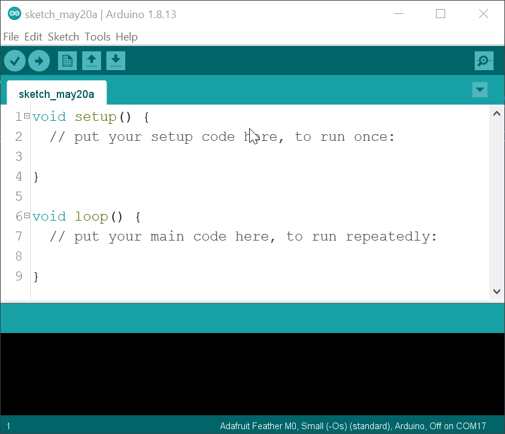

 _(This project page was originally intended for a workshop given at the Mapping Festival 2021 in Geneva, Switzerland. That's why the page is in French.)_
_**If you don't speak French but are curious to know more about the project, don't hesitate to write me.**_
_**It is an ongoing project, I will translate the page into English as soon as I have time.**_ 

# Invisible-network

Invisible Network est projet réalisé par les designer **[Paul Lëon](https://www.instagram.com/paul_leon_noel/)** et **[Evan Kelly](https://www.instagram.com/evan_kly/)**, tout deux cofondateur du design lab _**[ZEROTERA](https://www.instagram.com/zerotera_0t/)**_. Cette page github est dédié à _Wibot_, un appareil portable qui rend la communication entre les machines perceptible et tangible. Ce dispositif agit comme un médiateur entre l'utilisateur et les machines qui l'entourent. À travers son écran, il indique les relations qu'il entretient avec son environnement personnel.

---

## Composants

Dans ce projet nous utilisions les composants suivants :

- Un microcontrôleur [Feather M0 + Wifi](https://learn.adafruit.com/adafruit-feather-m0-wifi-atwinc1500/)
- Un [module GPS](https://learn.adafruit.com/adafruit-ultimate-gps/arduino-wiring)
- Un écran E-paper [2.9" Grayscale eInk](https://learn.adafruit.com/adafruit-eink-display-breakouts/grayscale-29-overview)
- [Une batterie 3.7 1000mAh - connecteur JST 2.0](https://www.bastelgarage.ch/lipo-akku-1000mah-jst-1-25-lithium-ion-polymer-fur-lora-ttgo?search=lipo)

---

## Assemblage

1. brancher le Feather M0 à l'écran
2. brancher le GPS au Feather M0 en passant par les pins de l'écran
3. brancher la batterie au Feather M0

1 - L'écran epaper est un _**wing**_ - _une aile en français_ -, elle a été conçu comme un _**shield**_ - _un bouclier en français_ - du jardon électronique qui veut que c'est un composant électronique conçu pour s'accrocher directement sur un autre dans notre cas le Feather M0. Vous pouvez donc directement brancher votre Feather M0 au dos de votre l'écran e-paper.

2 - Brancher les câble dans le port de l'écran situées au même niveau que votre carte

_(GPS - câble - Fether M0)_

- 3.3V - long cable rouge - 3V
- GND - long cable noir - GND
- TX - câble jaune - RX
- RX - petit câble rouge - TX

**Les couleurs de câbles sur le schéma ne sont pas corrects, référez vous à la descritpion ci-dessus**


_(image credits : All rights reserved by [lady ada](https://learn.adafruit.com/assets/99289#))_

3 - La batterie est munie d'un connecteur JST 2.0 directemeent branchable au Feather M0

Il n'y qu'un seul sens dans lequel le sens JST peut se brancher, pas de risque de se tromper.

---

## Setup

Commencer il vous faut installer l'application [Arduino](https://www.arduino.cc/en/software) qui vous permettra d'écrire du code et de l'envoyer à notre micro controleur. Si vous avez déjà Arduino IDE installé, notez que toute version à partir de la 1.8.0 fonctioneron pour ce projet.

Une fois installée, en l'ouvrant l'application arduino vous devriez voir une fenêtre qui ressemble à ça.

_(si vous êtes sous MacOS la fenêtre sera légerement différente, le menu se trouvera en dehors de la fenêtre dans la barre de navigation mac habituelle)_


Avant de pouvoir vraiment commencer il nous faut encore installer les _Boards Manager_ qui nous permettra de communiquer à le model spécifique de notre micro controleur.
Cela se fait en 2 étapes : (_[EN documentation here](https://learn.adafruit.com/adafruit-feather-m0-wifi-atwinc1500/setup)_)

### 1 - Ajouter les _Boards Mananger_ nécessaire pour utiliser le micro controller M0

Rendez vous dans les préférences de l'IDE Arduino.
--> `Fichier > Préférences`

Copier l'URL suivante `https://adafruit.github.io/arduino-board-index/package_adafruit_index.json` sous le paramettre _Url de gestionnaire des cartes supplémetnaries_


### 2 - Installer les _Boards_

Rendez vous dans les Gestionnaire de carte.
--> `Outils > Type de carte: > Gestionnaire de Carte`

Installez les paquets suivants :

- **Adafruit AVR Boards**
- **Adafruit SAMD Boards**

Pour cela taper, un à un, le nom de packets dans la barre de recherche et cliquer sur le boutton installez de l'élément correspondant.


---

**ATTENTION**

**La paquet `Adafruit SAMD Boards` est parfois capricieux est peu nécessité plusieurs tentative avant de correctement s'installer.**

Vous pouvez vérifier que la paquet est bien installé si à côté de son apparêt le label `INSTALLED`


Pour les utilisateur.trice.x.s de Windows 7 & 8, il vous faudra installer un driver supplémetaire

---

## Premier pats

Il est mainteant temps de tester que tout fonctionne !
Branchez un câble micro usb à votre micrôcontrôleur et l'autre extermité à votre ordinateur. Si la carte est correctement branchée elle devrait normalement allumer une led, le plus souvent une led rouge juste à côté du port USB.

_Si aucune led n'est allumé sur la carte, c'est que le câble USB n'est pas adéquat ou que le port USB de votre ordinateur a est defectueux. Changer USB, changez de port USB est reassayer._

1 - Sélectionner la carte du modèle **Feather M0**

`Outils > Type de carte: > Adafruit SAMD(32.bits... > Adafruit Feather M0`

(_si le sous-menu **Adafruit SAMD(32.bits...)** n'apparait pas, c'est que le paquet **Adafruit SAMD Boards** n'a été correction installé --> revenez au chapitre #Setup_)


2 - Sélectionner le bon port USB

`Outils > Port > ...(Adafruit Feather M0)`
Selon votre système d'exploitation le numéro de port affiché avant **Adafruit Feather M0**

- Windows : le plus souvent `COM` ex. COM7 (Adafruit Feather M0), COM14...
- MacOs : `/dev/cu` ou `/dev/tty.usbserail-xxxx` ex. /dev/tty.usbserail-1234 /dev/tty.usbserail-xxxx
- MacOs + usb Hub : `/dev/cu.usbmodem`

Si aucun des ports de la liste du menu `Outils > Port` ne contient _Adafruit Feather M0_ c'est soit que l'un des paquets **Adafruit AVR Boards** ou **Adafruit SAMD Boards** est mal installé, soit que le câble USB n'est pas adapté.

Sélectionner le port comprenant _Adafruit Feather M0_


Il est maintenant temps de téléverser un premier code sur le Feather M0 !

Ouvrez le fichier .ino de l'exemple [Blink](https://github.com/paulllleon/Invisible-network/blob/main/electronic/basic/blink/blink.ino)

```C++
// la fonction setup s'exécute une fois lorsque vous appuyez sur reset ou allumez la carte
void setup() {
  // initialiser la broche numero 13 comme une sortie.
  pinMode(13, OUTPUT);
}

// la fonction loop se lance  à la fin se fonction setup et se répète à l'infini
void loop() {
  digitalWrite(13, HIGH);   // allume la LED (HIGH)
  delay(1000);              // attend 1 seconde
  digitalWrite(13, LOW);    // éteind la LED en mettant la tension basse(LOW)
  delay(1000);              // attend 1 seconde
}
```

Ce code fait clignoter la LED rouge se trouvant juste à côté du porc USB.

Pour téléverser le code au Feather M0 il suffis de sélectionner le bon type de carte et le port :

- Outils > Type de carte: > Adafruit SAMD(32.bits... > Adafruit Feather M0
- Outils > Port > ...(Adafruit Feather M0)
- Appuyer sur le symbole → (flèche vert la droite) situé en haut à gauche de l'IDE Arduino


Si tout se passe bien

- compilation du croquis
- téléversement ...
- téleversement terminé

Si vous êtes passé par ces trois étapes, la LED rouge à côté du porc USB devrait clignoter.

Si ce n'est pas le cas essayer de mettre votre Feather M0 en _**bootloader**_ manuel. Pour cela, cliquez 2 fois (double clickez) sur le button _RESET_ de votre Feather M0. Le bouton _RESET_ est le petit button noir qui se trouve juste à côté du port USB du Feather M0.


_image origignal by [lady ada](https://learn.adafruit.com/users/adafruit) published under this [LICENSE](http://creativecommons.org/licenses/by-sa/3.0/)_

Si le Feather est dans le mode attendu, la LED rouge située à côté du port USB du Feather M0 devrait pulser. SI la LED ne pulse pas, double clickez à nouveau

Vous pouvez maintenant sélectionner le nouveau : `Outils > Port > ...(Adafruit Feather M0)` puis téléverser le code.

---

_**De manière général, si un code ne parvient pas être téléversé c'est qu'un de ces paramettre n'est pas correct.**_

- Type de Carte
- Port USB
- le Feather M0 n'est pas en mode _**bootloader**_

_**Vérifier ces trois paramettre et effectuer les actions suivantes**_

- Sélectionner le bon type de carte : `Outils > Type de carte: > Adafruit SAMD(32.bits... > Adafruit Feather M0`
- double clicker sur le button reset de du Feather M0 pour le mettre en mode _**bottloader**_
- Sélectionner le bon port USB : `Outils > Port > ...(Adafruit Feather M0)`
- Appuyer sur le symbole → (flèche vert la droite) situé en haut à gauche de l'IDE Arduino

---

## Installation de bibliothèques

Les bibliothèques sont des bouts codes réalisés par la communauté arduino ou des fabriquants de composants électronique. Les bibliotèque permette notamment de communiquer plus facilement avec des compsoants et utilisant des fonction simple qui nous "prémache" le travail.

Dans notre cas, nous aurons besoin de biblothèques pour :

- afficher du contenu sur l'écran e-paper
- récupérer l'heure et la position géographique
- scanner les réseaux wifi
- communiquer avec la database

Pour télécharger une bibliothèque rendu vous dans le gestionnaire de bibliothèque

`Outils > Gérer les bibliothèques`

De la même manière que les pacquets, tapez le nom de la bibliothèque dans la bar de rechercher et cliquez sur le bouton _Installer_

---

## Tester les composants

Télécharger les biblothèques listé ci-dessous

- Pour l'utilisation do module GPS
  - _Adafruit GPS Library_
- Pour utiliser le module Wifi integré au Feather M0
  - _WiFi101_
- Pour communiquer avec la base de donnée Firebase
  - _Firebase Arduino based on WiFi101_
- Pour utiliser l'écran e-paper
  - _Adafruit GFX Library_
  - _Adafruit ImageReader Library_

**Ormi le téléchargement des bibliothèques**, l'étape de tester chacun des composants n'est pas obligatoire mais peu vous permettre de comprendre comment chaque composants fonctionne individuellement.

Si vous souhaiter finalisé le module _**Wibot**_ au plus vite e, passez au chapitre suivant : **#Connexion à la base de donnée**

Pour tester chacun des composants utiliser les exemples dans le dossier [electronic/test_component](https://github.com/paulllleon/Invisible-network/tree/main/electronic/test_component)

Pour téléverser les différents exemples à votre Feather M0, référez vous à la fin du chapitre **#Premier pats**.

La plupart des exemples utilise avec la fonction de debug `Serial.print()` qui permet d'afficher des informations dans le **Moniteur série**. Pour y accéder, une fois le téléversement terminé, cliqué sur le symbole de ⚲ loupe situé en haut à droite de l'IDE arduino.


**Si l'un des exemple ne fonctionne pas, assurer vous d'avoir bien installé toutes les bibliothèques requises et reessayer de téléverser le code.**

---

## Connexion à la base de donnée

- Ouvrez le code [FirmwareUpdater_wifi](https://github.com/paulllleon/Invisible-network/tree/main/electronic/database/FirmwareUpdater_wifi)
- Télévesez le code

- Update firmware _([EN documentation + images](https://learn.adafruit.com/adafruit-feather-m0-wifi-atwinc1500/updating-firmware))_

`Outils > WiFi101 / WiFiNINA Firmware Updater`

- Sélectionner le port contenant `Adafruit Feather M0`
- clicker le bouton **Test connection**
- (si aucun message d'erreur n'est apparu) - sous **Update firmware** choisissez le premire élément contenant `WINC1501 Model B ...` puis clikcez sur le bouton **Update Firmware**

Dernière étape, la plus importante dans ce process, toujours dans la fenêtre **WiFi101 / WiFiNINA Firmware/Certficates Updater**

- Update certificat SSL _([EN documentation + image](https://learn.adafruit.com/adafruit-feather-m0-wifi-atwinc1500/updating-ssl-certificates))_
- Dans la section **3. Update SSL root certificates** clickez add domain
- copiez cette URL :
  `invisible-network-default-rtdb.europe-west1.firebasedatabase.app`
- clickez sur le bouton **Upload Certificates**

---

Maintenant le certificat installé, vous devriez pouvoir vous connecter à la base de données.

- Ouvrer le fichier de l'exemple [connexion_to_Database](https://github.com/paulllleon/Invisible-network/blob/main/electronic/database/connexion_to_Database/connexion_to_Database.ino)
- Changer les paramètres correspondant à votre réseau

```C++
  #define WIFI_SSID "Paul’s iPhone" // le nom de votre réseau wifi
  #define WIFI_PASSWORD "noproblemno" // le mot de passse de votre réseau
```

- Changer le `USER_NAME` pour un nom qui vous sier (**éviter les espace et les caractère spéciaux**)

```C++
  String USER_NAME = "test"; //le pseudo que vous avez chois sans espace ni caractère spécial
```

- Téléverser le code
- Ouvrez le Moniteur Série

Si vous ne parvenez pas à vous connecter à votre réseau wifi, vérifier que le `WIFI_SSID` soit correctement orthographier. Dans le cas de présence de caractère spéciaux je vous conseil d'utiliser l'exemple [wifi_scan-network](https://github.com/paulllleon/Invisible-network/tree/main/electronic/test_component/wifi_scan-network) pour scanner les wifi alentour et copier le nom de votre wifi affiché dans le Moniteur série.

Si tout fonctionne, le Moninteur série imprime _**le message test a été envoyé**_

Si ce n'est pas le cas, le Moniteur série devraient afficher _**CONNECTION REFUSED**_, vérifier que le certificat SSL est bien installé.

---

## Finalisation de wibot

Ouvrez le fichier [/electronic/wibot_mapping_festival](https://github.com/paulllleon/Invisible-network/tree/main/electronic/wibot_mapping_festival)

- Changer les paramettre corespondant à votre réseau `WIFI_SSID` et `WIFI_PASSWORD`
- Changer le `USER_NAME` pour un nom qui vous sier (**éviter les espace et les caractère spéciaux**)

```C++
  #define WIFI_SSID "Paul’s iPhone" // le nom de votre réseau wifi
  #define WIFI_PASSWORD "noproblemno" // le mot de passse de votre réseau
  ...
  ...
  ...
  String USER_NAME = "paul"; //le pseudo que vous avez chois sans espace ni caractère spécial
```

- Téléverser le code
- Vérifier dans la Moniteur série qu'il n'y ai pas de _**CONNECTION REFUSED**_

Si tout semble correctement fonctionner, vous pouvez débrancher le câble USB de votre Feather M0 et continuer à l'alimenter via la batterie 3.7v.

_Votre *Wibot* est maintenant près à explorer les réseaux invisibles, bravo !_
